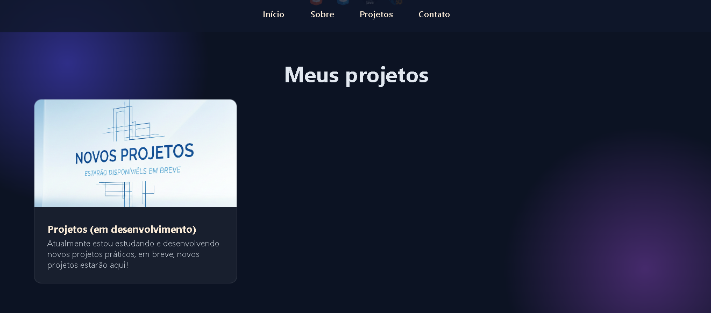

# 🌐 Portfólio | Matheus Mello

🚀 Portfólio pessoal desenvolvido com HTML, CSS e JavaScript, foco em design moderno e responsivo.

---

## 🔗 Acesse o site aqui! https://matheus-mell0.github.io/portfolio/

---

## 📸 Preview

---

## 🛠️ Tecnologias utilizadas
- HTML5
- CSS3
-javaScript
---

## 📌 Funcionalidades
- Layout moderno
- Navegação suave
- Design responsivo
- Animações com CSS

---

## 📂 Estrutura do projeto
📦 portfolio
 ┣ 📂 img
 ┣ 📜 index.html
 ┣ 📜 style.css
 ┗ 📜 README.md
